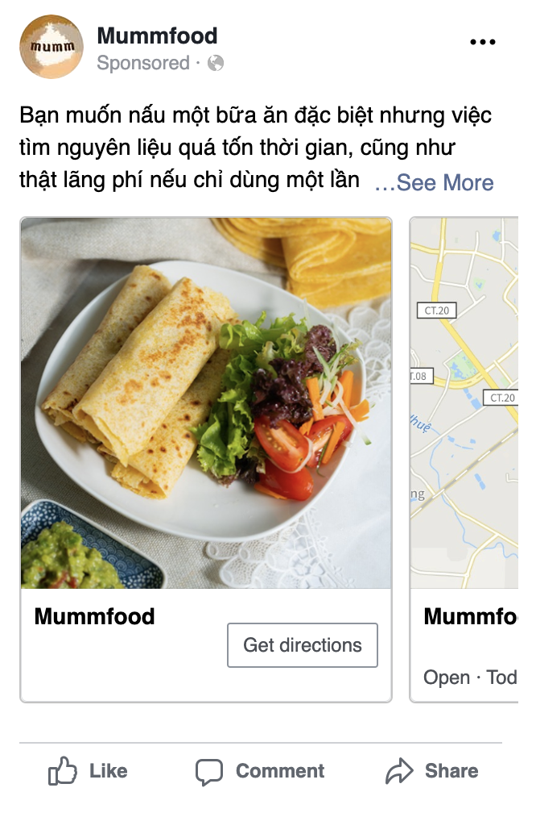

# Mumm food Strategy

## Facebook

### Report 29-September ~ 05-October

**Page Views**

**Post Views**

### Campaign 1: Promote Local Business

Focus making customers the area around to make order.

With the Map and Direction. Customers will immediately understand the location of the business.

Target:
- 5km around the shop area
- Standard Mumm food potential Customers
- Medium spending

Expectation:
- Get the customer to click on the ad and read about Mumm
- Understand the service and menu

<!--  -->

### Campaign 2: Traffic

Focus increase the views of the page.

Choose beautiful picture of menu. Show on all media of Facebook. Think of this a spread of information. We aim for wide reach.

Target:
- 20km around the shop area
- Wide range of customer demographic
- Low spending

Expectation:
- Increase the views of the page. More view => more recognition on digital
- Build up the brand image by show the consistent and beautiful logo and image of menu.

<!--  -->

### Campaign 3: Post

Focus customer understand the service and system.

High frequency of changing the content by regularly posting on Facebook. Content of the post focus on high quality food, safe environment, special service, etc.

Target:
- 10km around the shop area
- Standard Mumm food potential Customers
- High spending

Expectation:
- Educate customer about shop service and menu
- Make order

<!--  -->

### Overall

Last week we have 193 views.

We can have a general aim to increase that number to 300 after 2 weeks. And 400 by end of month.

## Google

### Report 29-September ~ 05-October

### Google Ads

Keywords: Mumm food, Đồ ăn trưa, Món ăn trưa, Mang về, Bữa ăn hằng ngày, Món ăn ngon gia đình, Bữa tối nấu sẵn, etc.

Aim for customer to search us through Google.

Target:
- Standard Mumm food potential Customers
- Low spending

### Website improvement

Modify for easier understand of the weekly menu

### Overall

This is maintenance of brand health. People should be able to reach us when searching on Google. Then view our service and menu easily.
